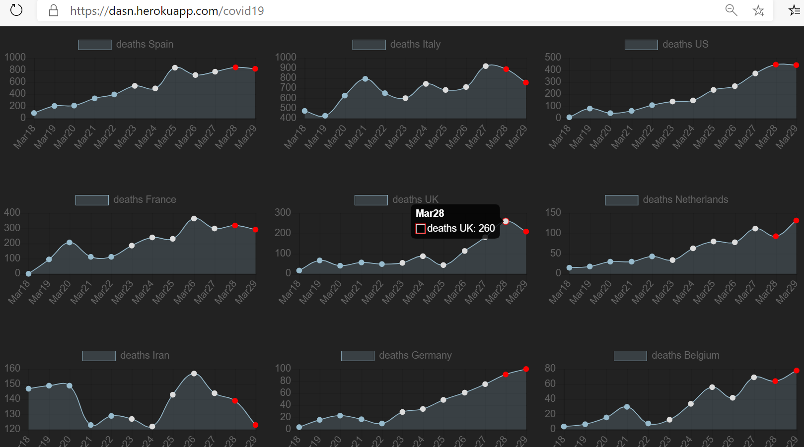

# COVID-19 Data Sources and Analysis

jupyter feeding charts grafics https://dasn.herokuapp.com/covid19  



## Source: World-cases, Age, Gender, Travel History
  - Data Feed: https://docs.google.com/spreadsheets/d/1itaohdPiAeniCXNlntNztZ_oRvjh0HsGuJXUJWET008/edit#gid=0
  - [] B Xu, M Kraemer, Open access epidemiological data from the COVID-19 outbreak, www.thelancet.com › article › PIIS1473-3099(20)30119-5 › Feb 19, 2020 
  - Curators: University of Oxford , Bo Xu,Bernardo Gutierrez,Sumiko Mekaru,Kara Sewalk,Alyssa Loskill,Lin Wang,Emily Cohn,Sarah Hill,Alexander Zarebski,Sabrina Li,Chieh-His Wu,Erin Hulland,Julia Morgan,Samuel Scarpino,John Brownstein,Oliver Pybus,David Pigott,Moritz Kraemer
  
## Source: World Stats Evolution per Coutry & Status
  - Data Feeds: https://github.com/CSSEGISandData/COVID-19/tree/master/csse_covid_19_data/csse_covid_19_time_series
  - hdx ocha https://data.humdata.org/dataset/novel-coronavirus-2019-ncov-cases https://raw.githubusercontent.com/CSSEGISandData/COVID-19/master/csse_covid_19_data/csse_covid_19_time_series/time_series_19-covid-Confirmed.csv
  - Curators: John Hopkins

## Source: China Summary Live Update
  - Data Feed, Isaac Lin: [API format](https://lab.isaaclin.cn/nCoV/api/overall?latest=0)
  - [Infectious Estimation of R0](https://github.com/yijunwang0805/YijunWang), Y. Wang
  - Li, Q., Guan, X., et al. (2020, January 29). [Early Transmission Dynamics in Wuhan, China, of Novel Coronavirus–Infected Pneumonia.](https://www.nejm.org/doi/full/10.1056/NEJMoa2001316#article_references) The New England Journal of Medicine. 

Note to contributors: aiming to add links closest to the original source or curation, (to avoid duplicated sources)

notes:

```
cp /c/Users/ma*/Down*/JH-calculate-daily*9?.ipynb JH-calculate-daily.ipynb
 ls -ltr /c/Users/ma*/Down*/*nb 
cp /c/Users/ma*/Down*/updates*6?.ipynb updates.ipynb
```
